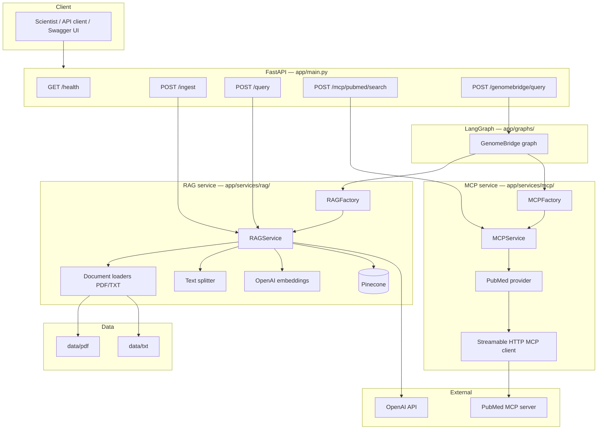
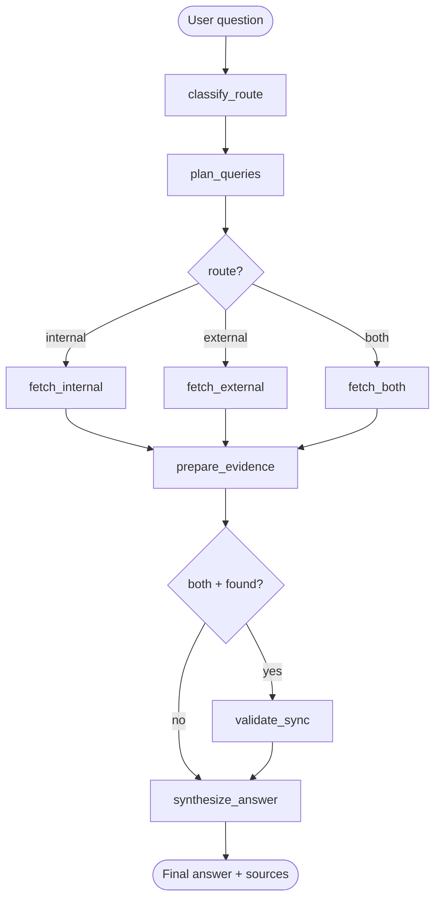

# NovaCrop-GenomeBridge

A FastAPI microservice for **NovaCrop Research Labs** that powers **GenomeBridge** — combining three capabilities:

1. **RAG** — ingest and query NovaCrop's internal knowledge base (PDF/TXT) via Pinecone
2. **MCP** — search external scientific literature on PubMed through an MCP server
3. **LangGraph (GenomeBridge)** — orchestrate routing, retrieval, cross-source validation, and answer synthesis

The GenomeBridge pipeline answers research questions by deciding whether to use internal documents, external PubMed literature, or both—and when both are available, it validates whether the sources align.

---

## Table of contents

- [Architecture](#architecture)
- [Design principles](#design-principles)
- [Project structure](#project-structure)
- [Prerequisites](#prerequisites)
- [Installation](#installation)
- [Configuration](#configuration)
- [Running the server](#running-the-server)
- [API reference](#api-reference)
- [GenomeBridge LangGraph pipeline](#genomebridge-langgraph-pipeline)
- [Testing guide](#testing-guide)
- [Example questions](#example-questions)
- [Technology stack](#technology-stack)

---

## Architecture

### System context



### GenomeBridge LangGraph pipeline



**Route values**

| Route | Meaning |
|-------|---------|
| `internal` | NovaCrop knowledge base only (RAG / Pinecone) |
| `external` | PubMed literature only (MCP) |
| `both` | Internal + external; runs RAG and PubMed in parallel |

**Evidence status values**

| Status | Meaning |
|--------|---------|
| `found` | Relevant results retrieved |
| `empty` | Query ran but nothing relevant found |
| `skipped` | Side not used for this route |

---

## Design principles

### Factory + dependency injection

Services are wired through factories—not global imports scattered across the codebase:

| Factory | Creates | Used by |
|---------|---------|---------|
| `RAGFactory` | `RAGService` | FastAPI `/ingest`, `/query`; LangGraph fetch nodes |
| `MCPFactory` | `MCPService` | FastAPI `/mcp/pubmed/search`; LangGraph fetch nodes |
| `get_genome_bridge_graph()` | Compiled LangGraph | FastAPI `/genomebridge/query` |

FastAPI endpoints use `Depends(get_rag_service)` and `Depends(get_mcp_service)` for the standalone APIs. LangGraph nodes call factories directly inside helpers.

### Modular RAG pipeline

Each RAG step is an independent service:

```
DocumentLoaderFactory → TextSplitterService → EmbeddingService → PineconeVectorStore → RAGService
```

- **Loaders** — strategy pattern for PDF (PyPDF) and TXT
- **Splitter** — LangChain `RecursiveCharacterTextSplitter`
- **Embeddings** — OpenAI `text-embedding-3-small` (1536 dimensions)
- **Vector store** — Pinecone serverless; index auto-created if missing

### Modular MCP pipeline

```
StreamableHttpMCPClient → PubMedMCPProvider → MCPProviderFactory → MCPService
```

The PubMed provider calls MCP tools `pubmed_search_articles` and `pubmed_fetch_articles` on a remote MCP server.

### LangGraph separation of concerns

| Layer | Location | Responsibility |
|-------|----------|----------------|
| **Nodes** | `app/graphs/nodes/` | One function per graph step |
| **Helpers** | `app/graphs/helpers/` | Fetch logic, evidence formatting |
| **Prompts** | `app/graphs/prompts/` | LLM prompt templates (not mixed with node code) |
| **Schemas** | `app/graphs/schemas/` | Pydantic models for structured LLM output |
| **State** | `app/graphs/state.py` | Shared `GenomeBridgeState` TypedDict |
| **API models** | `app/graphs/api_models.py` | Request/response models for `/genomebridge/query` |

### Structured LLM outputs

Nodes that need typed LLM responses use `with_structured_output()` with Pydantic schemas:

- `classify_route` → `RouteClassification`
- `plan_queries` → `QueryPlan`
- `validate_sync` → `ValidationAssessment`
- `synthesize_answer` → plain text (final answer)

---

## Project structure

```
NovaCrop-GenomeBridge/
├── app/
│   ├── main.py                    # FastAPI app and all HTTP endpoints
│   ├── configs/
│   │   └── config.py              # Settings from environment variables
│   ├── graphs/
│   │   ├── genome_bridge_graph.py # LangGraph definition
│   │   ├── graph_factory.py       # Cached graph instance
│   │   ├── state.py               # GenomeBridgeState and dataclasses
│   │   ├── api_models.py          # GenomeBridge API request/response
│   │   ├── nodes/                 # Graph node implementations
│   │   ├── helpers/               # Fetch and evidence helpers
│   │   ├── prompts/               # LLM prompt templates
│   │   └── schemas/               # Structured output schemas
│   └── services/
│       ├── rag/                   # RAG pipeline (loaders, splitter, embeddings, Pinecone)
│       └── mcp/                   # MCP clients, PubMed provider
├── data/
│   ├── pdf/                       # PDF documents for ingestion
│   └── txt/                       # TXT documents for ingestion
├── .env.example                   # Environment variable template
├── pyproject.toml                 # Dependencies (managed with uv)
├── uv.lock                        # Locked dependency versions
└── README.md
```

---

## Prerequisites

- **Python** 3.12+
- **[uv](https://docs.astral.sh/uv/)** package manager (recommended)
- **OpenAI API key** — embeddings + chat completions
- **Pinecone API key** — vector storage
- **Network access** — PubMed MCP server (default: `https://pubmed.caseyjhand.com/mcp`)

---

## Installation

### 1. Clone the repository

```bash
git clone <repository-url>
cd NovaCrop-GenomeBridge
```

### 2. Install dependencies

```bash
uv sync
```

This creates a virtual environment (`.venv`) and installs all packages from `pyproject.toml` / `uv.lock`.

> **Note:** A `requirements.txt` is not required. This project uses `pyproject.toml` + `uv.lock`. If a deploy target needs `requirements.txt`, generate it with:
> ```bash
> uv export --no-dev -o requirements.txt
> ```

### 3. Configure environment variables

```bash
cp .env.example .env
```

Edit `.env` with your credentials:

```env
OPENAI_API_KEY=sk-your-openai-api-key
PINECONE_API_KEY=pcsk-your-pinecone-api-key
PINECONE_INDEX_NAME=novacrop-genomebridge
PUBMED_MCP_URL=https://pubmed.caseyjhand.com/mcp
```

| Variable | Required | Description |
|----------|----------|-------------|
| `OPENAI_API_KEY` | Yes | OpenAI API key for embeddings and chat |
| `PINECONE_API_KEY` | Yes | Pinecone API key |
| `PINECONE_INDEX_NAME` | Yes | Pinecone index name (created automatically if missing) |
| `PUBMED_MCP_URL` | No | PubMed MCP server URL (has sensible default) |

### 4. Add documents (optional)

Place files in:

- `data/pdf/` — PDF files
- `data/txt/` — plain text files

Sample data is included: `data/txt/Drought_Tolerance_Rice.txt`.

---

## Running the server

```bash
uv run uvicorn app.main:app --reload --host 0.0.0.0 --port 8000
```

Or:

```bash
uv run python -m app.main
```

**Swagger UI:** http://localhost:8000/docs

**ReDoc:** http://localhost:8000/redoc

---

## API reference

### `GET /health`

Health check.

**Response:** `{ "status": "ok" }`

```bash
curl http://localhost:8000/health
```

---

### `POST /ingest`

Ingest all PDF and TXT files from `data/pdf/` and `data/txt/` into Pinecone.

**Run this first** before using RAG or GenomeBridge internal routes.

**Response:**

```json
{
  "chunks_by_directory": {
    "/path/to/data/pdf": 42,
    "/path/to/data/txt": 15
  }
}
```

```bash
curl -X POST http://localhost:8000/ingest
```

---

### `POST /ingest/{filename}`

Ingest a single file by name (looks in `data/pdf/` then `data/txt/`).

```bash
curl -X POST http://localhost:8000/ingest/Drought_Tolerance_Rice.txt
```

---

### `POST /query`

Standalone RAG query against NovaCrop's internal knowledge base.

**Request body:**

```json
{
  "question": "What SNP markers are linked to drought tolerance in rice?",
  "top_k": 5
}
```

| Field | Type | Default | Description |
|-------|------|---------|-------------|
| `question` | string | required | Research question |
| `top_k` | int | 5 | Pinecone chunks to retrieve (1–20) |

**Response:**

```json
{
  "answer": "NovaCrop identified 12 SNP markers associated with drought tolerance..."
}
```

```bash
curl -X POST http://localhost:8000/query \
  -H "Content-Type: application/json" \
  -d '{"question": "What SNP markers are linked to drought tolerance in rice?"}'
```

---

### `POST /mcp/pubmed/search`

Standalone PubMed search via the MCP server.

**Request body:**

```json
{
  "query": "drought tolerance markers rice",
  "maxResults": 5,
  "sort": "pub_date",
  "hasAbstract": true,
  "dateRange": {
    "minDate": "2023",
    "maxDate": "2026",
    "dateType": "pdat"
  }
}
```

| Field | Type | Default | Description |
|-------|------|---------|-------------|
| `query` | string | required | PubMed search query |
| `maxResults` | int | 5 | Max articles (1–100) |
| `sort` | string | `pub_date` | Sort order |
| `hasAbstract` | bool | `true` | Require abstracts |
| `dateRange` | object | null | Optional publication date filter |

**Response:** query, pmids, total_count, and articles with pmid, title, abstract, authors, journal, doi, and URLs.

```bash
curl -X POST http://localhost:8000/mcp/pubmed/search \
  -H "Content-Type: application/json" \
  -d '{
    "query": "drought tolerance markers rice",
    "maxResults": 5,
    "dateRange": { "minDate": "2023", "maxDate": "2026" }
  }'
```

---

### `POST /genomebridge/query`

Full GenomeBridge LangGraph pipeline: route → plan queries → fetch → validate (if both) → synthesize.

**Request body:**

```json
{
  "question": "What have we and others published on drought markers in rice since 2023?"
}
```

**Response fields:**

| Field | Description |
|-------|-------------|
| `answer` | Final synthesized answer |
| `route` | `internal`, `external`, or `both` |
| `route_reason` | Why this route was chosen |
| `internal_query` / `external_query` | Rewritten search queries |
| `internal_status` / `external_status` | `found`, `empty`, or `skipped` |
| `internal_sources` / `external_sources` | Retrieved evidence with excerpts |
| `in_sync` | `true`/`false` when both sides found; `null` otherwise |
| `validation` | Cross-source comparison; `null` when not validated |

```bash
curl -X POST http://localhost:8000/genomebridge/query \
  -H "Content-Type: application/json" \
  -d '{"question": "What have we and others published on drought markers in rice since 2023?"}'
```

> First request may take 30–60+ seconds (multiple LLM calls + Pinecone + PubMed). Uses `graph.ainvoke()` because fetch nodes are async.

---

## GenomeBridge LangGraph pipeline

### Nodes

| Node | Type | Description |
|------|------|-------------|
| `classify_route` | sync | LLM classifies question as `internal`, `external`, or `both` |
| `plan_queries` | sync | LLM rewrites question into RAG/PubMed queries; extracts date filters |
| `fetch_internal` | sync | RAG retrieval via `RAGFactory` |
| `fetch_external` | async | PubMed search via `MCPFactory` |
| `fetch_both` | async | RAG + PubMed in parallel (`asyncio.gather`) |
| `prepare_evidence` | sync | Normalizes state; clears validation when sync won't run |
| `validate_sync` | sync | LLM compares internal vs external evidence |
| `synthesize_answer` | sync | LLM produces final answer (or deterministic message if no evidence) |

### Conditional routing

1. **After `plan_queries`** → `fetch_internal` | `fetch_external` | `fetch_both` based on `route`
2. **After `prepare_evidence`** → `validate_sync` only when `route == both` and both sides are `found`; otherwise skip to `synthesize_answer`

### Run from terminal (no HTTP)

```bash
uv run python -c "
import asyncio, json
from app.graphs.graph_factory import get_genome_bridge_graph

async def main():
    graph = get_genome_bridge_graph()
    result = await graph.ainvoke({
        'question': 'What have we and others published on drought markers in rice since 2023?'
    })
    print(json.dumps(result, indent=2, default=str))

asyncio.run(main())
"
```

---

## Testing guide

### Recommended order

1. Start server: `uv run uvicorn app.main:app --reload`
2. Health check — `GET /health`
3. Ingest documents — `POST /ingest` (required before internal/both routes)
4. Test RAG alone — `POST /query`
5. Test MCP alone — `POST /mcp/pubmed/search`
6. Test full pipeline — `POST /genomebridge/query`

Open http://localhost:8000/docs for Swagger UI.

---

## Example questions

| Route | Example question |
|-------|------------------|
| `internal` | What drought SNP markers did we identify in our rice trials? |
| `external` | What has PubMed published on drought tolerance markers in rice? |
| `both` | What have we and others published on drought markers in rice since 2023? |

---

## Technology stack

| Component | Technology |
|-----------|------------|
| API framework | FastAPI + Uvicorn |
| Orchestration | LangGraph |
| LLM / embeddings | OpenAI (`gpt-4o-mini`, `text-embedding-3-small`) |
| Vector database | Pinecone (serverless) |
| Document parsing | PyPDF, LangChain text splitters |
| External literature | PubMed via MCP (streamable HTTP) |
| Package management | uv (`pyproject.toml` + `uv.lock`) |
| Config | python-dotenv |

### Default model settings (`app/configs/config.py`)

| Setting | Default |
|---------|---------|
| Chat model | `gpt-4o-mini` |
| Embedding model | `text-embedding-3-small` |
| Embedding dimension | 1536 |
| Chunk size | 1000 |
| Chunk overlap | 200 |
